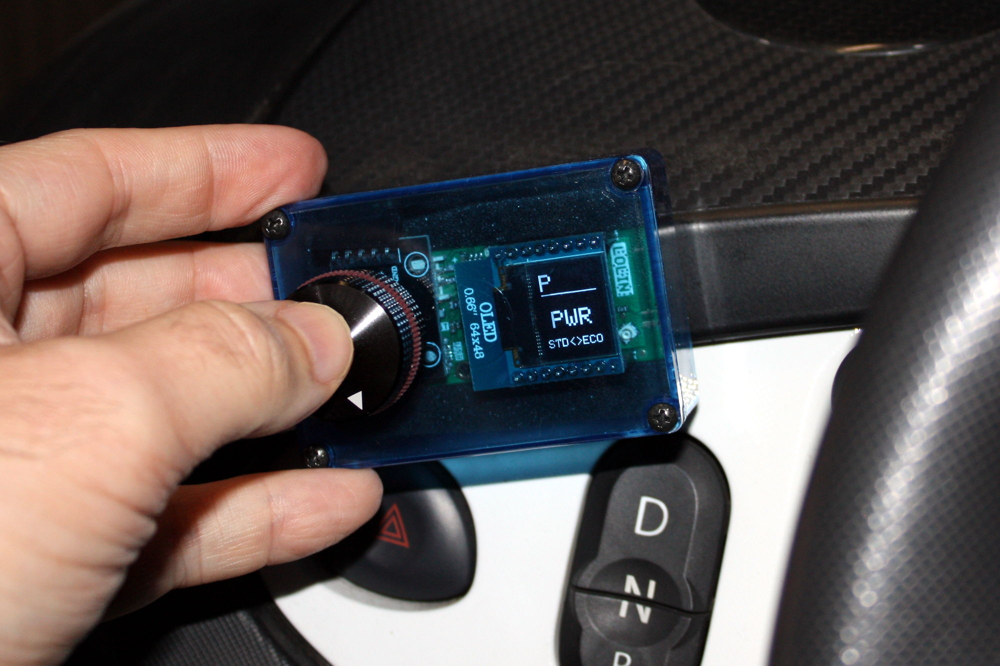
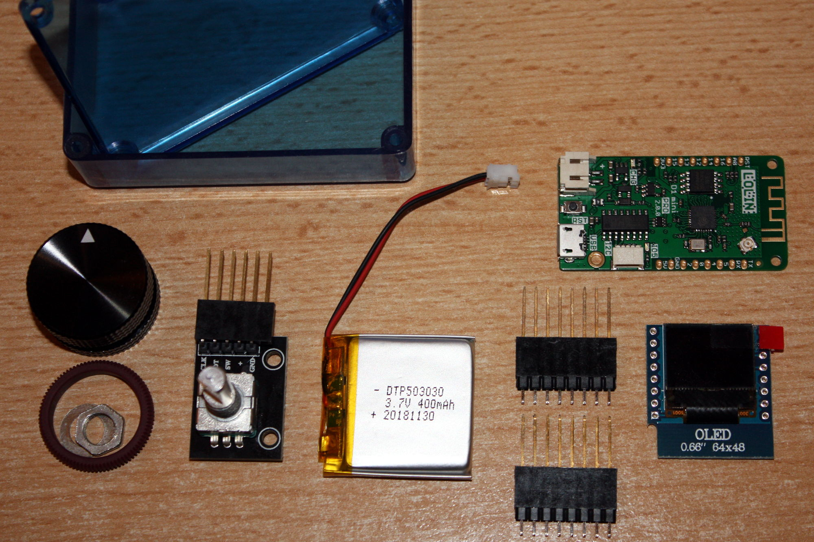
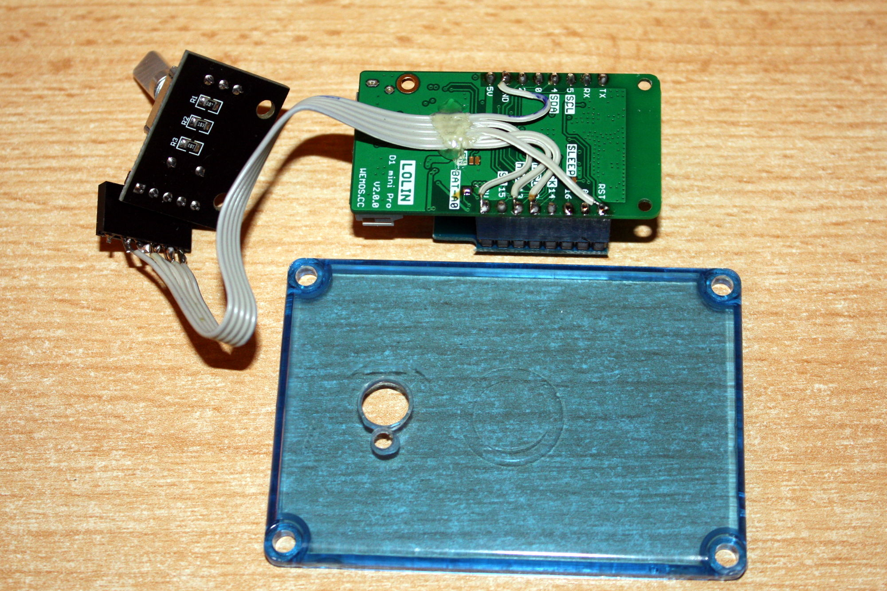

# OVMS v3 WifiConsole

This is a wireless tuning console for
[OVMS v3](https://github.com/openvehicles/Open-Vehicle-Monitoring-System-3) / Renault Twizy.

It supports loading profiles and changing the neutral/brake recuperation levels
as well as the drive power level on the fly.

## Usage

- Push the knob to activate or switch to the next page.
- Turn the knob to change the value.
- Rest the knob to apply the change (or push again to cancel).

## Hardware

Did I mention it's just a frontend for an OVMS v3 module? So of course you'll need an OVMS v3.
The OVMS v3 firmware version should be `3.2.005-51` or higher.

And you'll need an unlocked Twizy if you want to use it to change the tuning. The console isn't
limited to tuning, you could for example use it to change the charge current level and destination
SOC as well.

### Parts

1. [WEMOS/LOLIN D1 mini Pro v2 (ESP8266 + battery shield)](https://www.makershop.de/plattformen/arduino/wemos-d1-mini-pro-v2-0-0/) ~9.35€
2. [WEMOS/LOLIN D1 OLED shield 64x48](https://www.exp-tech.de/displays/oled/9151/wemos-oled-shield) ~8.57€
3. [Rotary Encoder KY-040](https://www.makershop.de/module/eingabe/drehregler-ky-040/) ~3.65€
4. [Knob](https://www.exp-tech.de/zubehoer/tasterschalter/6037/metall-drehknopf-25mm-durchmesser) ~4.22€
5. [LiPo battery 2mm JST, e.g. 400 mAh](https://www.exp-tech.de/zubehoer/batterien-akkus/lipo-akkus/5800/lipo-akku-400mah-3.7-v-2-mm-jst) ~3.95€
6. [Female headers (2x8 pin, 1x5 pin)](https://www.makershop.de/zubehoer/kleinteile/buchsenleiste-weiblich/) ~1.95€
7. [Flat cable 5 pin 10 cm](https://www.makershop.de/zubehoer/kabel/jumper-wire-kabel-10p-20cm/) ~1.00€
8. [Casing with transparent window/cover](https://www.conrad.de/de/p/strapubox-2024bl-universal-gehaeuse-72-x-50-x-26-abs-blau-transparent-1-st-525967.html) ~3.38€
9. [USB micro/mini adapter](https://www.reichelt.de/usb-micro-b-stecker-auf-mini-usb-buchse-delock-65063-p110052.html) ~1.50€

Total: ~37,57€ + shipping. Links are just examples.

The D1 mini pro v2 includes a LiPo shield, you may also use a standard D1 + separate battery shield.

The USB adapter is meant to extend the D1 mini Pro USB port to the casing side, so you don't need
to open the casing to charge the battery. There may be other/better solutions to this.

### Build

1. Solder the 8 pin female headers to the D1 mini and the included male pin headers to the OLED shield.
2. Connect the solder switch labeled `BAT-A0` on the D1 mini back side.
3. Connect the `RST` solder switch on the OLED module if it has one.
4. Solder the 5 pin flat cable to the back of the D1 mini as shown below, fix the cable using hot glue.
5. Solder the female 5 pin header to the other end.
6. Connect all components (double check polarity).
7. Load the firmware & test the system.
8. Calibrate the battery voltage.
9. Mount into the casing.

__Rotary encoder connection__:

| KY-040 | D1 mini |
| --- | --- |
| `GND` | `GND` |
| `+` | `3V3` |
| `SW` | `RST` |
| `DT` | `12` |
| `CLK` | `13` |

**Note**: there are OLED clones on the market that don't connect the reset line (`RST`). Clones
can be identified by not having the Wemos logo. They will normally work, but may freeze when pushing
the knob during a screen rendering. If that happens you'll need to unplug the battery to revive
the OLED. Workaround is to always wait until the display is stable before pushing the knob again.

## Software

If you haven't yet installed the ESP8266 support into your Arduino environment, do so first
by following the guide: https://github.com/esp8266/Arduino

Add these libraries if not yet installed:
- [IoAbstraction @davetcc](https://github.com/davetcc/IoAbstraction)
- [Adafruit_SSD1306 @mcauser](https://github.com/mcauser/Adafruit_SSD1306/tree/esp8266-64x48)

### WifiConsole Firmware

1. Download the ZIP, extract, open `WifiConsole/WifiConsole.ino` from Arduino IDE.
2. Select the board "WEMOS (LOLIN) D1 mini Pro" as the build destination.
3. Enter your configuration in the `WifiConsole_config.h` tab, build & flash.
4. Use the serial monitor to check the debug output.
5. Calibrate your battery voltage reading.

### OVMS Script Plugin

The module side script plugin implements the command interface for the console:

1. Open OVMS web UI: Tools → Editor.
2. Paste the [WifiConsole.js](extras/WifiConsole.js) plugin into the editor.
3. Save as `/store/scripts/lib/WifiConsole.js` (add the directories if needed).
4. Open `/store/scripts/ovmsmain.js` (create if needed).
5. Add a line `wificon = require("lib/WifiConsole");` & save.
6. Open Tools → Shell, issue `script reload`.

## Configuration

The WifiConsole reads the tuning profiles and quick access buttons from the OVMS module.
Use the OVMS web UI (Twizy → Profile Editor & Twizy → Drivemode Config) to create tuning
profiles and assign button labels. Maximum label length supported by the console is
3 characters (more will be cut off), and default maximum number of buttons is 10 (can be changed).

The WifiConsole firmware configuration is done in the `WifiConsole_config.h` file.
See comments for explanations.

You normally only need to change the module data and the battery calibration. Customize
the timeouts to your taste.

## Battery Life

According to my tests, the 400 mAh battery will last for about 4 hours of continuous operation.
With default sleep timeout of 60 seconds, a normal interaction time will be around 1.5-2
minutes, so the battery will last for about 120-160 activations.

## Author

WifiConsole has been created and is maintained by Michael Balzer (<dexter@dexters-web.de> / https://dexters-web.de/).

## Donations

**Donations** to support my efforts and further development are very welcome.  
Please send donations via **Paypal** to: `dexter@dexters-web.de`  
**Thanks! :-)**

## License

This is free software; you can redistribute it and/or modify it under the terms of the [GNU Lesser General Public License](https://www.gnu.org/licenses/lgpl.html) as published by the Free Software Foundation; either version 3 of the License, or (at your option) any later version.

This software is distributed in the hope that it will be useful, but WITHOUT ANY WARRANTY; without even the implied warranty of MERCHANTABILITY or FITNESS FOR A PARTICULAR PURPOSE.  See the GNU Lesser General Public License for more details.

You should have received a copy of the GNU Lesser General Public License along with this software; if not, write to the Free Software Foundation, Inc., 51 Franklin St, Fifth Floor, Boston, MA  02110- 1301  USA

**Have fun!**
